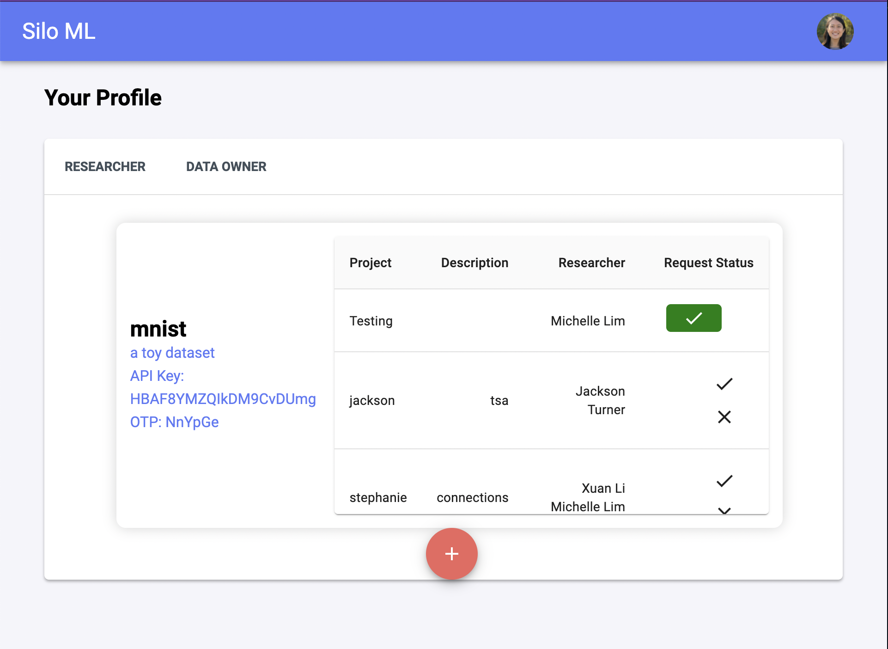
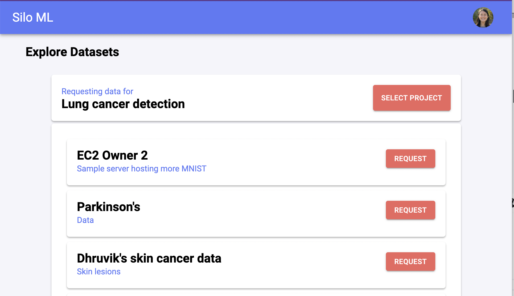

# SiloML Webapp

SiloML is a federated data platform for life science researchers to answer questions about clinical data that’s physically on their partners’ databases.

## Features

This is the code for the [SiloML](https://siloml.us) webapp. In the webapp:

- Data owners (provider partners) can register their data sets. They run the dataowner server ([`SiloML/silo-dataowner`](https://github.com/SiloML/silo-dataowner)) and key in the provided OTP to the server locally to associate the server with their account.
  

- Researchers can then connect to these data sets on a per-project basis. When the datasets are connected, they run their researcher worker ([`SiloML/silo-researcher`](https://github.com/SiloML/silo-researcher)) locally to begin the federated learning process.
  

## Live version

You can visit the live version on [app.siloml.us](https://app.siloml.us).

## How to run locally

In the project directory, you can run:

### `yarn start`

Runs the app in the development mode. 
Open [http://localhost:3000](http://localhost:3000) to view it in the browser.

The page will reload if you make edits. 
You will also see any lint errors in the console.

## How to deploy

### `yarn build`

Builds the production files in the build/ folder.

### `firebase deploy`

Set up firebase-tools and then deploy the build/ folder to the Firebase silo-ml project.
